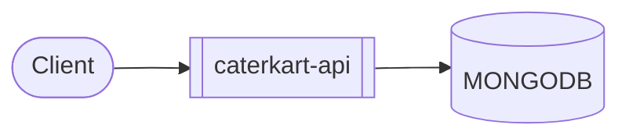
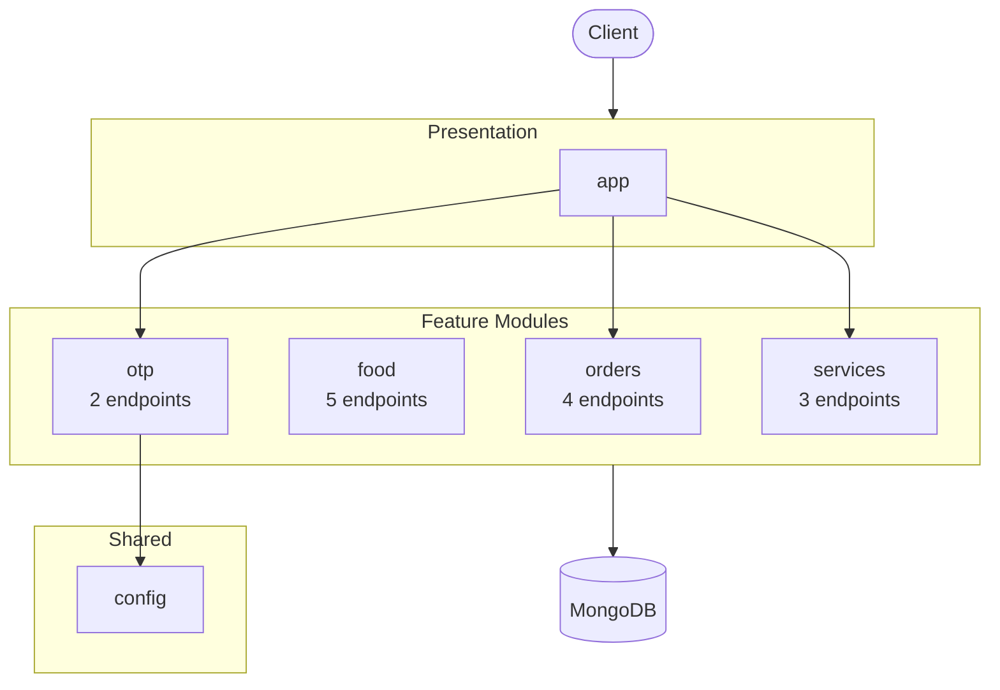
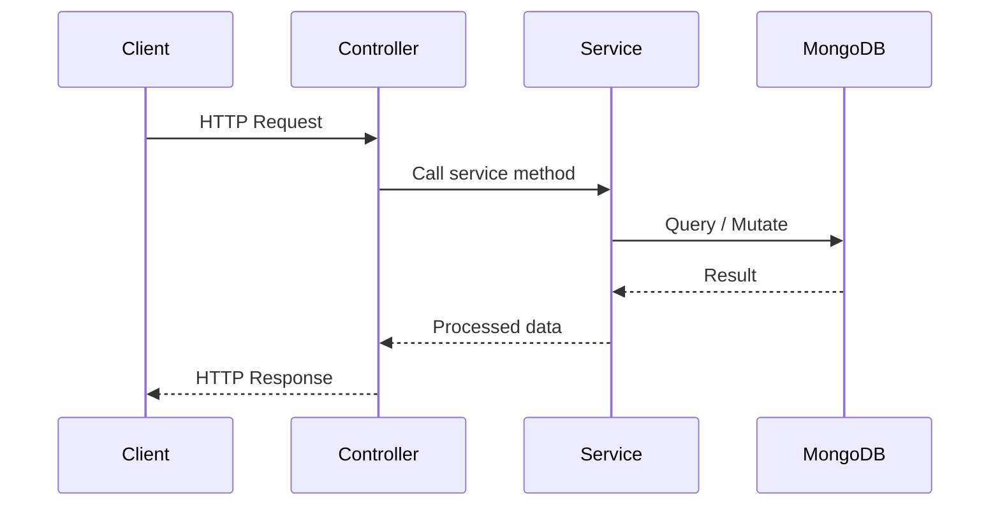
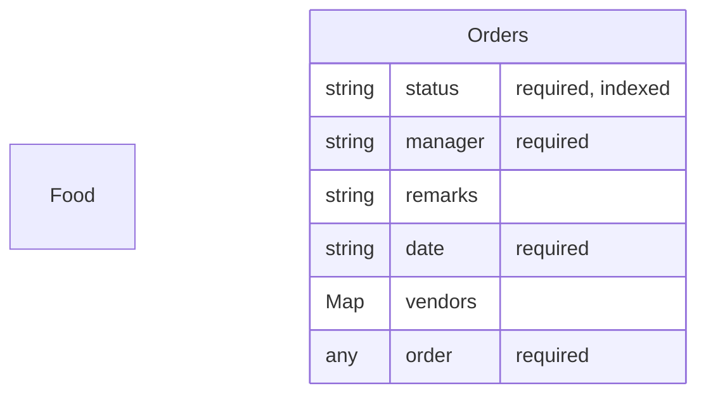

# caterkart-api

*Auto-generated by [zinsight](https://github.com/zinboard/zinsight) on 2026-05-24*

## What This App Does

**Caterkart Api** is a **backend API service** built with **NestJS** that enables users to process orders.

The codebase follows a **modular, controller-service, schema-driven** architecture — each feature is a self-contained module with clear separation between HTTP handling (controllers), business logic (services), and data access (schemas).

### Core Capabilities

- **Order management** — 4 endpoints
- **Inventory management**

### Infrastructure

- Configuration management

In total, the system exposes **15** API endpoints, **2** data models, **7** modules.

**Connects to:** **MongoDB** for data storage

## Overview

| **22** files · **1,449** lines of code · **7** modules · **15** API endpoints · **2** data models · MongoDB |
|---|

**Project docs:** [Description](README.md)

## At a Glance

A 60-second mental snapshot — what calls in, what we call out, where state lives.



## Core Concepts

Domain vocabulary used throughout the codebase. Read this first if names look unfamiliar.

| Term | Kind | What it means | Defined in |
|------|------|---------------|------------|
| **Orders** | `entity` | Domain entity (6 fields). | `src/orders/orders.schema.ts` |
| **Food** | `route` | HTTP resource at `/food` (5 endpoints). Sample: `/food`. | `src/food/food.controller.ts` |
| **Health-check** | `route` | HTTP resource at `/health-check` (1 endpoint). Sample: `/health-check`. | `src/app/app.controller.ts` |
| **Order** | `route` | HTTP resource at `/order` (4 endpoints). Sample: `/order/`. | `src/orders/orders.controller.ts` |
| **Services** | `route` | HTTP resource at `/services` (3 endpoints). Sample: `/services/:eventName`. | `src/services/services.controller.ts` |
| **Verify** | `route` | HTTP resource at `/verify` (2 endpoints). Sample: `/verify/send-otp`. | `src/otp/otp.controller.ts` |
| **AppService** | `service` | Service class — encapsulates business logic for one feature area. | `src/app/app.service.ts` |
| **FoodService** | `service` | Service class — encapsulates business logic for one feature area. | `src/food/food.service.ts` |
| **OrdersService** | `service` | Service class — encapsulates business logic for one feature area. | `src/orders/orders.service.ts` |
| **OtpService** | `service` | Service class — encapsulates business logic for one feature area. | `src/otp/otp.service.ts` |
| **ServicesService** | `service` | Service class — encapsulates business logic for one feature area. | `src/services/services.service.ts` |

## Walking Through One Request

The most-trafficked path is **`GET /food/:area`**. Picked from the food.controller.ts (5 endpoints in that file) — typical read-by-id path through the system.

Trace this once and you understand the whole request lifecycle.

1. **Client sends GET /food/:area**
2. **Controller `getFoodByArea()` is invoked** — `src/food/food.controller.ts`
   Defined in src/food/food.controller.ts.
3. **Service `getFoodByArea()` runs business logic** — `src/food/food.service.ts`
   Controller delegates to the matching service; data validation and authorization checks live here.
4. **Reads/writes MONGODB**
   Scoped query (typically by orgId) against the `food` collection.
5. **Response returned to client (JSON)**
   NestJS / Express serializes the service return value.

## Where State Lives

Every persistence and caching surface in the system.

- **Persistent (database)** — MONGODB — 1 model, 9 distinct operations.
  - Sample files: `src/app/app.module.ts`, `src/food/food.service.ts`, `src/main.ts`, `src/orders/orders.controller.ts`, `src/orders/orders.moudle.ts`
- **Environment variables** — 5 environment variables drive runtime behaviour.

## Conventions

Implicit rules the codebase follows. When you add new code, follow these — when you read code, expect these.

- **Module → Controller → Service triplet per feature folder**
  - _Evidence:_ 4 of 5 feature folders follow this pattern.

## Lifecycle

Things that happen when the app boots, when requests arrive, and when external systems trigger us.

**On boot**

- Application bootstrap (trigger: `Process start`) — `src/main.ts`

**Per request**

- Per-request lifecycle: middleware → guards → controller → service → response (trigger: `Each HTTP request`)

## How to Get Productive

Pick a goal — read the listed files in order — be productive in minutes, not days.

### Understand the request lifecycle (15 min)

1. `src/main.ts` — Where the app boots and registers everything.
2. `src/orders/orders.controller.ts` — Representative controller — read to see the public API surface.
3. `src/orders/orders.service.ts` — The matching service — most business logic lives here.

### Add a new feature (template to copy) (10 min)

1. `src/app/app.controller.ts` — Routes + DTOs.
2. `src/app/app.module.ts` — Module wiring — what to register.
3. `src/app/app.service.ts` — Business logic.

## Where to Look

Common questions answered up front. If you want to change something, this tells you which files to open.

| If you want to change... | Look in |
|--------------------------|---------|
| **Database schemas** — _Data models — the shape of stored data._ | `src/orders/orders.schema.ts` |
| **API endpoints** — _HTTP routes the server exposes._ | `src/app/app.controller.ts`, `src/food/food.controller.ts`, `src/orders/orders.controller.ts`, `src/otp/otp.controller.ts`, `src/services/services.controller.ts` |
| **Configuration / Environment** — _Where env vars are read and the server bootstraps._ | `src/config/constants.ts`, `src/main.ts` |

## What This Repo Isn't

Stops you looking for things that don't exist here.

- **No frontend in this repo** — _No .tsx/.jsx files and no client/frontend/web/ui folder._
- **No background job queue** — _No bull/kafka/rabbitmq/sqs imports detected._
- **No file uploads** — _No multer/busboy/formidable/FileInterceptor usage detected._
- **No payment processing** — _No payment-provider integration detected._
- **Single-region deployment (no multi-region replication detected)** — _No explicit multi-region configuration found._

## Table of Contents

- [What This App Does](#what-this-app-does)
- [Overview](#overview)
- [At a Glance](#at-a-glance)
- [Core Concepts](#core-concepts)
- [Walking Through One Request](#walking-through-one-request)
- [Where State Lives](#where-state-lives)
- [Conventions](#conventions)
- [Lifecycle](#lifecycle)
- [How to Get Productive](#how-to-get-productive)
- [Where to Look](#where-to-look)
- [What This Repo Isn't](#what-this-repo-isnt)
- [Tech Stack](#tech-stack)
- [Architecture](#architecture)
- [Modules](#modules)
- [API Endpoints](#api-endpoints)
- [Database](#database)
- [Environment Variables](#environment-variables)
- [Getting Started](#getting-started)
- [Testing](#testing)
- [New Developer Guide](#new-developer-guide)

## Tech Stack

| Category | Technologies |
|----------|-------------|
| **Runtime** | Node.js |
| **Languages** | TypeScript |
| **Frameworks** | NestJS |
| **Databases** | MongoDB (Mongoose) |
| **ORM / Data Layer** | Mongoose, NestJS Mongoose |
| **Testing** | Jest, SuperTest |
| **Build & Dev Tools** | ESLint, Prettier, TypeScript |
| **Other Notable** | RxJS, class-transformer, class-validator, dotenv |

## Architecture



### Request Lifecycle



## Modules

| Module | Purpose | Files | Lines |
|--------|---------|-------|-------|
| **orders** | Read APIs for order (4 endpoints). | 5 | 431 |
| **food** | Read APIs for food (5 endpoints). | 4 | 399 |
| **otp** | CRUD APIs for verify (2 endpoints). | 4 | 134 |
| **app** | Read APIs for health-check (1 endpoint). | 3 | 59 |
| **services** | Read APIs for services (3 endpoints). | 3 | 383 |
| **config** | Feature module — 1 file, 1 public export. | 1 | 7 |

## API Endpoints — 15 endpoints

### Food — 5 endpoints

`src/food/food.controller.ts`

| Method | Path | Handler | Description |
|--------|------|---------|-------------|
| GET | `/food` | `getAll`| List all food |
| GET | `/food/:area` | `getFoodByArea`| Get food by area |
| GET | `/food/inventory` | `getFoodInventory`| Get food inventory |
| PUT | `/food/inventory/:id` | `updateInventory`| Update inventory |
| GET | `/food/inventory/list/:area` | `getFoodList`| Get food list |

### Orders — 4 endpoints

`src/orders/orders.controller.ts`

| Method | Path | Handler | Description |
|--------|------|---------|-------------|
| GET | `/order/` | `getAllOrders`| List all order |
| POST | `/order/` | `createOrder`| Create order |
| GET | `/order/:id` | `getOrderById`| Get order by ID |
| PUT | `/order/:id` | `replaceOrder`| Replace order |

### Services — 3 endpoints

`src/services/services.controller.ts`

| Method | Path | Handler | Description |
|--------|------|---------|-------------|
| GET | `/services/:eventName` | `getServicesByEvent`| Get services by event |
| GET | `/services/inventory/:category` | `getInventory`| Get inventory |
| PUT | `/services/inventory/:category/:id` | `updateInventoryItem`| Update inventory item |

### Otp — 2 endpoints

`src/otp/otp.controller.ts`

| Method | Path | Handler | Description |
|--------|------|---------|-------------|
| POST | `/verify/send-otp` | `sendOTP`| Send o tp |
| POST | `/verify/verify-otp` | `verifyOTP`| Verify o tp |

### App — 1 endpoint

`src/app/app.controller.ts`

| Method | Path | Handler | Description |
|--------|------|---------|-------------|
| GET | `/health-check` | `getHello`| Root endpoint / health check |

## Database

| **MongoDB** — 2 models |
|---|

### Running Database Locally

Start a local MongoDB instance:

```bash
# Using Docker
docker run -d --name mongo -p 27017:27017 mongo:latest

# Or install locally: https://www.mongodb.com/docs/manual/installation/
```

**ORM / Driver:** Mongoose, NestJS Mongoose

**Models (2):** `Food`, `Orders`

**Operations used:** `countDocuments`, `create`, `find`, `findById`, `findByIdAndUpdate`, `findOne`, `findOneAndUpdate`, `lean`, `updateOne`

**Schema / config files:** `src/orders/orders.schema.ts`

### Schema Details

<details>
<summary><strong>Orders</strong> — 6 fields, 4 required, 1 indexed</summary>

> Defined in `src/orders/orders.schema.ts`

| Field | Type | Constraints |
|-------|------|-------------|
| `status` | string | required, indexed, default: "new" |
| `manager` | string | required, default: "dhanush" |
| `remarks` | string | default: "" |
| `date` | string | required |
| `vendors` | Map | — |
| `order` | any | required |

**Indexes:** `status`

</details>

### Data Model



## Environment Variables

### Required vs Optional

**4 required** (no fallback) · **1 optional** (default present in code).

| Required Variable | Risk if missing |
|-------------------|-----------------|
| `PORT` | Server defaults to a fallback port. |
| `TWILLIO_ACCOUNT_SID` | Unknown — depends on what this variable controls. |
| `TWILLIO_AUTH_TOKEN` | Unknown — depends on what this variable controls. |
| `TWILLIO_SERVICES_ID` | Unknown — depends on what this variable controls. |

| Optional Variable | Default | Risk if missing |
|-------------------|---------|-----------------|
| `ALLOWED_ORIGINS` | `` | Unknown — depends on what this variable controls. |

**Authentication & Secrets**

| Variable | Used in |
|----------|---------|
| `TWILLIO_AUTH_TOKEN` | `src/config/constants.ts` |

**Server**

| Variable | Used in |
|----------|---------|
| `ALLOWED_ORIGINS` | `src/main.ts` |
| `PORT` | `src/main.ts` |

**Application**

| Variable | Used in |
|----------|---------|
| `TWILLIO_ACCOUNT_SID` | `src/config/constants.ts` |
| `TWILLIO_SERVICES_ID` | `src/config/constants.ts` |

## Getting Started

### Prerequisites

- **Node.js** (check `.nvmrc` or `engines` in package.json for version)
- **npm** as package manager

### Installation

```bash
# Clone the repository
git clone <repository-url>
cd <project-directory>

# Install dependencies
npm install

# Set up environment variables
cp .env.example .env  # then fill in your values
```

### Running Locally

```bash
# Start development server with hot reload
npm run start:dev

# Start production server
npm start

# Build for production
npm run build

# Run linter
npm run lint

# Format code
npm run format

```

## Testing

**Framework:** Jest, SuperTest

```bash
# Run tests
npm test

# Run tests in watch mode
npm run test:watch

# Run tests with coverage
npm run test:cov

# Run end-to-end tests
npm run test:e2e
```

## Usage Examples

> Example API calls for key endpoints. Replace `localhost:3000` with your actual host.

```bash
# getHello
curl -X GET http://localhost:3000/health-check

# getFoodByArea
curl -X GET http://localhost:3000/food/{area}

# getAll
curl -X GET http://localhost:3000/food

# createOrder
curl -X POST http://localhost:3000/order/ \
  -H "Content-Type: application/json" \
  -d '{ }'

# updateInventory
curl -X PUT http://localhost:3000/food/inventory/{id} \
  -H "Content-Type: application/json" \
  -d '{ }'
```

## New Developer Guide

> Everything you need to get oriented in this codebase as a new team member.

### Project Structure

```
src/
├── orders/                 # Feature module (API + business logic) (5 files, 431 loc)
├── food/                   # Feature module (API + business logic) (4 files, 399 loc)
├── services/               # Feature module (API + business logic) (3 files, 383 loc)
├── otp/                    # Feature module (API + business logic) (4 files, 134 loc)
├── app/                    # Feature module (API + business logic) (3 files, 59 loc)
└── config/                 # App configuration (1 files, 7 loc)
```

### Key Files

| # | File | Category | Lines | Why read this |
|---|------|----------|-------|---------------|
| 1 | `src/main.ts` | Entry Point | 35 | Application bootstrap — initializes 1 dependencies, sets up middleware, and starts the server. Start here to understand how the app is wired together |
| 2 | `src/app/app.module.ts` | Configuration | 36 | Root module that wires together all feature modules, middleware, and providers — the dependency injection map for the entire app |
| 3 | `src/config/constants.ts` | Configuration | 7 | Configuration for config — exports: default |
| 4 | `src/orders/orders.schema.ts` | Data Model | 90 | Defines: OrdersDocument, Orders, OrdersSchema, OrdersModelName — shapes the orders data layer, referenced by 2 files across the codebase |
| 5 | `src/food/food.service.ts` | Business Logic | 280 | Implements food business logic (280 lines) — consumed by 2 files, powers 5 API endpoints, exports: categories, FoodService |
| 6 | `src/services/services.service.ts` | Business Logic | 341 | Implements services business logic (341 lines) — consumed by 2 files, powers 3 API endpoints, exports: ServicesService |
| 7 | `src/orders/orders.service.ts` | Business Logic | 164 | Implements orders business logic (164 lines) — consumed by 2 files, powers 4 API endpoints, exports: OrdersService |
| 8 | `src/food/food.controller.ts` | API Surface | 43 | Defines the food API surface with 5 endpoints (GET: 4, PUT: 1) — read to understand request/response contracts |
| 9 | `src/orders/orders.controller.ts` | API Surface | 74 | Defines the orders API surface with 4 endpoints (GET: 2, POST: 1, PUT: 1) — read to understand request/response contracts |
| 10 | `src/otp/otp.controller.ts` | API Surface | 46 | Defines the otp API surface with 2 endpoints (POST: 2) — read to understand request/response contracts |

### Patterns

- **Module-Controller-Service (NestJS)** — Each feature is a self-contained module with a controller (handles HTTP) and service (business logic). New features follow the same pattern: create `feature.module.ts`, `feature.controller.ts`, `feature.service.ts`.
- **DTO Validation** — Data Transfer Objects validate and shape incoming request data. Create matching DTOs for new endpoints to ensure type safety.
- **Mongoose Schema Decorators** — Database models use `@Schema()` and `@Prop()` decorators. Define schemas in `schemas/` and register them in the relevant module with `MongooseModule.forFeature()`.

### Common Tasks

| If you want to... | Start here | Pattern to follow |
|-------------------|-----------|-------------------|
| Add a new API endpoint | `src/services/services.controller.ts` | Copy an existing controller+service pair and register the module |
| Add a new database model | `src/orders/orders.schema.ts` | Create schema, add to module's `MongooseModule.forFeature()` imports |
| Add an environment variable | `src/app/app.module.ts` | Add to `.env`, reference via `process.env.VAR_NAME` or config service |
| Understand the startup flow | `src/main.ts` | Follow imports from main → app module → feature modules |
| Debug a failing request | Check controller → service → database query in that order | Most bugs are in the service layer |

---

*Generated by [zinsight](https://github.com/zinboard/zinsight)*
